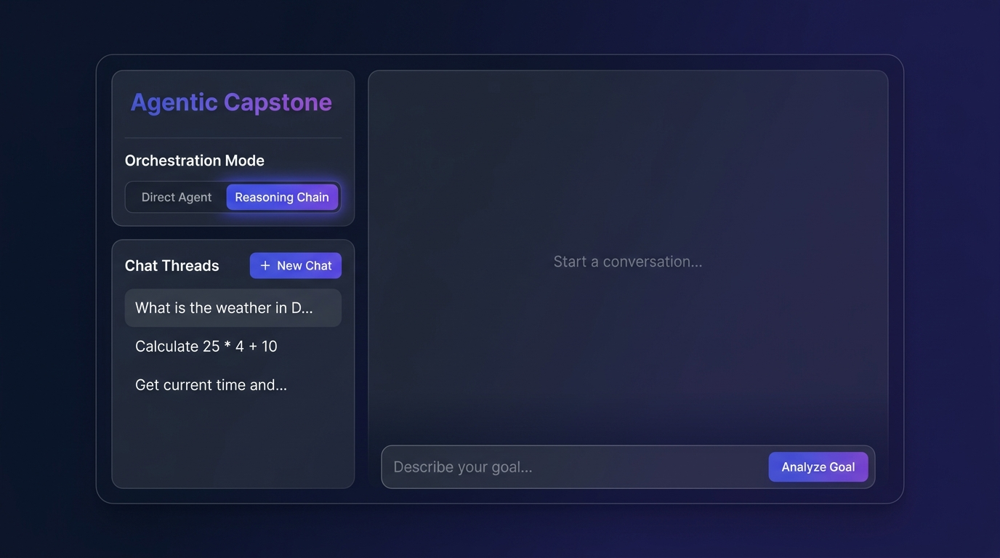
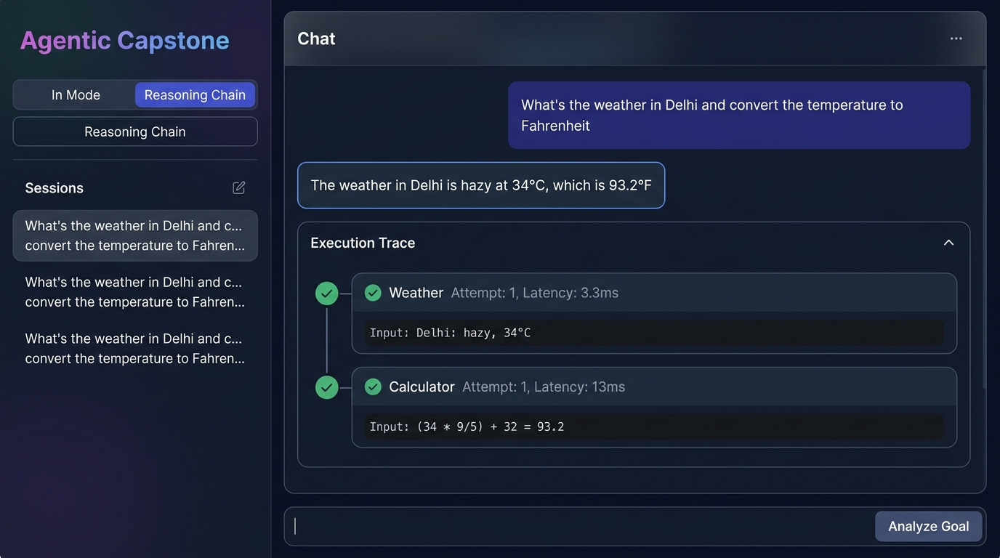
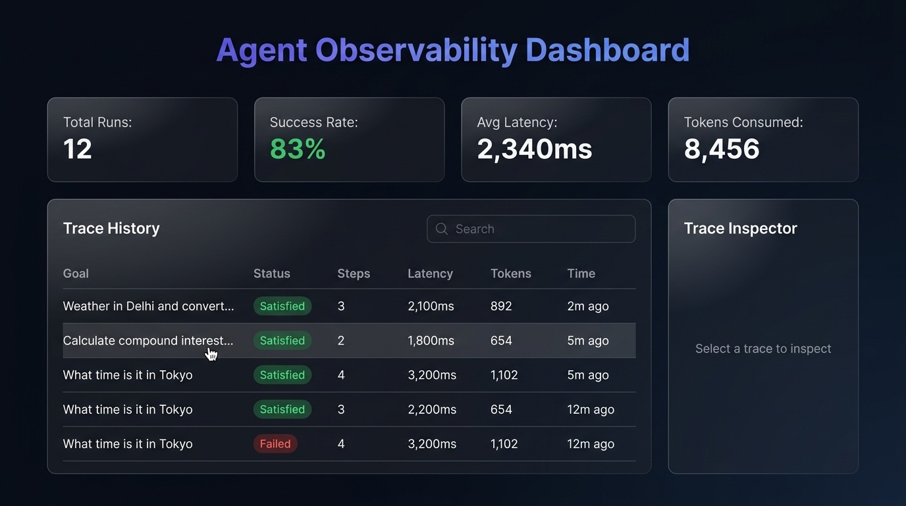
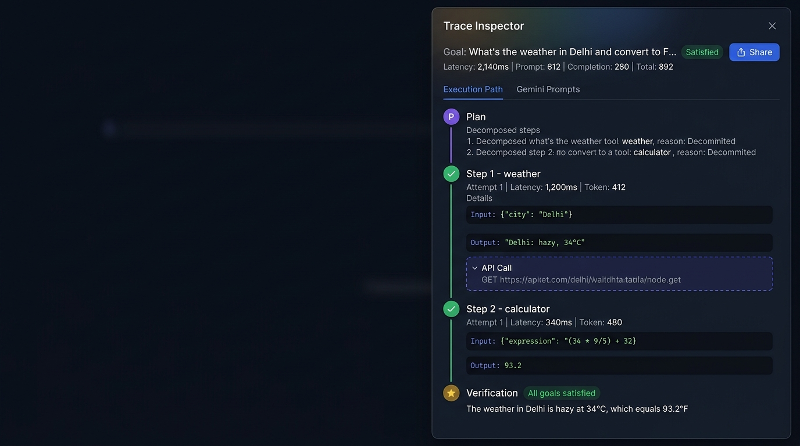
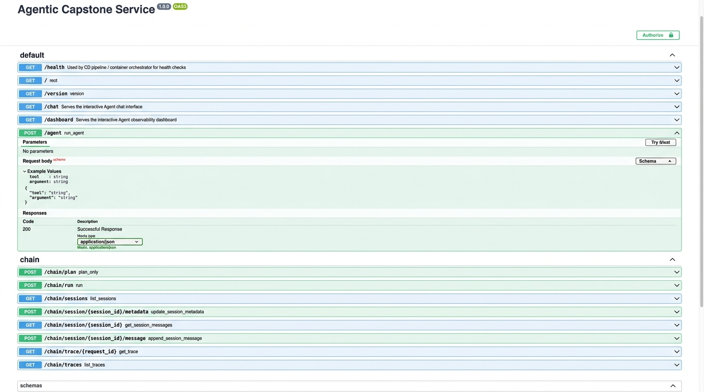
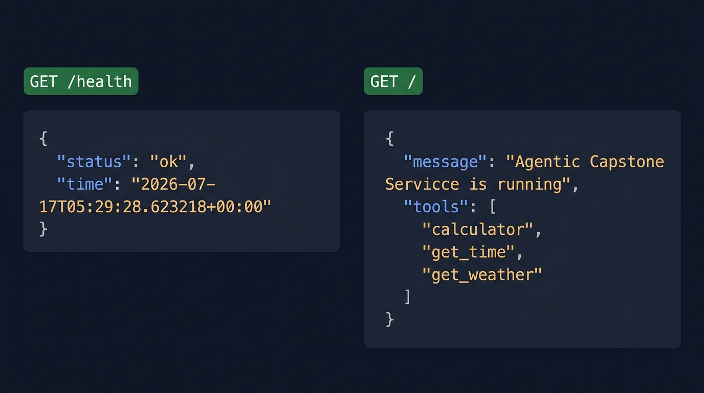

# Agentic Capstone: Tool-Calling Service + Full CI/CD Pipeline

A minimal FastAPI service that simulates an "agent" calling tools
(calculator, get_time, get_weather), wrapped in a complete
Git → Docker → GitHub Actions CI/CD pipeline.

This project exists to practice the **infrastructure** side of agentic
AI systems engineering — the agent logic is intentionally simple.

## Project structure

```
agentic-capstone/
├── app/
│   ├── main.py              # FastAPI app + 3 tools + UI routes
│   └── static/
│       ├── chat.html         # Interactive chat interface
│       └── dashboard.html    # Observability dashboard
├── reasoning_chain/
│   ├── chain.py              # ReAct loop orchestrator (Gemini)
│   ├── router.py             # /chain API routes + Redis persistence
│   ├── schemas.py            # Pydantic data contracts
│   └── tools.py              # Instrumented tools with failure injection
├── tests/
│   ├── test_app.py           # API endpoint tests
│   └── test_chain.py         # Reasoning chain logic tests
├── docs/
│   └── screenshots/          # UI and API screenshots
├── .github/workflows/
│   ├── ci.yml                # lint + test + docker build check
│   └── cd.yml                # build, push to GHCR, deploy, rollback
├── Dockerfile                 # multi-stage, non-root, healthcheck
├── docker-compose.yml          # local dev: app + redis
├── docker-compose.prod.yml     # production: GHCR image + redis
├── requirements.txt
├── requirements-dev.txt
└── pyproject.toml             # ruff + pytest config
```

## Run it locally (no Docker)

## Screenshots

### Chat Interface (`/chat`)
The interactive chat UI supports two orchestration modes: **Direct Agent** (manual
tool selection) and **Reasoning Chain** (goal-based multi-step reasoning via Gemini).

<p align="center">
  
</p>

### Reasoning Chain in Action
A multi-step conversation showing the ReAct loop: the agent decomposes a goal into
tool calls, executes them, and returns a verified answer with a collapsible
execution trace timeline.

<p align="center">
  
</p>

### Observability Dashboard (`/dashboard`)
Real-time metrics (success rate, latency, token usage), a searchable trace history
table, and a detailed trace inspector panel for debugging agent behavior.

<p align="center">
  
</p>

### Trace Inspector — Execution Path
Drill into any trace to see the full execution timeline: plan decomposition, each
tool step with input/output/latency/tokens, API call details, and verification
outcome.

<p align="center">
  
</p>

### API Documentation (`/docs`)
Auto-generated Swagger UI showing all 14 endpoints across the core service and
reasoning chain modules.

<p align="center">
  
</p>

### API Endpoints
Live JSON responses from the health check and root service info endpoints.

<p align="center">
  
</p>

## Run it locally (no Docker)

```bash
python -m venv .venv
source .venv/bin/activate      # on Windows: .venv\Scripts\activate
pip install -r requirements-dev.txt
uvicorn app.main:app --reload
```

Visit http://localhost:8000/docs for the interactive Swagger UI.

Try it:
```bash
curl -X POST http://localhost:8000/agent \
  -H "Content-Type: application/json" \
  -d '{"tool": "calculator", "argument": "2 + 2 * 10"}'
```

## Run it with Docker

```bash
docker build -t agentic-capstone .
docker run -p 8000:8000 agentic-capstone
```

## Run the full stack (app + redis) with Compose

```bash
docker compose up --build
```

## Run tests

```bash
pytest -v
ruff check app tests
```

## Setting up the pipeline on GitHub

1. Create a new repo on GitHub and push this code:
   ```bash
   git init
   git add .
   git commit -m "Initial commit: agentic capstone scaffold"
   git branch -M main
   git remote add origin <your-repo-url>
   git push -u origin main
   ```

2. **CI** (`ci.yml`) runs automatically on every push/PR — no setup needed.
   It lints with `ruff`, runs `pytest` across Python 3.11 and 3.12, and
   verifies the Docker image builds.

3. **CD** (`cd.yml`) runs on every push to `main`. It:
   - Builds and pushes your image to GitHub Container Registry (GHCR)
   - Tags it with both the git SHA (traceable) and `latest`
   - Runs a placeholder deploy step
   - Health-checks the deployed service
   - Rolls back automatically if the health check fails

   To make the deploy step real, add these **repo secrets**
   (Settings → Secrets and variables → Actions):
   - `APP_HEALTH_URL` — e.g. `https://your-app.fly.dev/health`
   - `DEPLOY_HOOK_URL` (if using Render) or configure `flyctl`/SSH auth
     depending on your host.

## Suggested learning path through this repo

1. Get it running locally, understand `main.py`
2. Make a change on a feature branch, open a PR, watch CI run
3. Intentionally break a test — watch CI fail and block the merge
4. Merge to `main` — watch CD build+push an image to GHCR
5. Pick a free host (Fly.io or Render) and wire up the real deploy step
6. Break the `/health` endpoint on purpose, deploy, and watch the
   rollback step trigger
7. Add a 4th tool to the agent and repeat the whole cycle

## Where this goes next (once comfortable)

- Swap the mock tools for real ones (weather API, real DB-backed memory)
- Add the Anthropic API as an actual reasoning/tool-selection layer
  instead of the client picking the tool directly
- Add structured logging + tracing for each tool call (important for
  debugging agent behavior in production)
- Add a staging environment + manual approval gate before prod deploy


# reasoning_chain

Plan → execute → verify/repair chain, built to drop into your existing
FastAPI tool-calling service.

## Wire it in

```python
# main.py (or wherever your FastAPI app is created)
from reasoning_chain.router import router as chain_router
app.include_router(chain_router, prefix="/chain")
```

Copy the `reasoning_chain/` folder next to your existing `app/` (or wherever
your calculator/get_time/weather tools currently live), then delete
`tools.py` here and point `chain.py`'s `TOOL_REGISTRY` import at your real
tools instead — this version's tools are just instrumented copies with
injectable failure so you can prove the resilience logic works.

## Endpoints

- `POST /chain/plan?goal=...` — decomposition only, no tools run. Use this
  first to sanity-check the model's reasoning.
- `POST /chain/run?goal=...` — full plan → execute → verify → repair loop.
  Returns the entire trace.
- `GET /chain/trace/{request_id}` — replay a past run from Redis.

## Try it locally

```bash
export ANTHROPIC_API_KEY=sk-...
uvicorn main:app --reload
curl -X POST "http://localhost:8000/chain/plan?goal=what+time+is+it+and+is+it+raining+in+Tokyo"
curl -X POST "http://localhost:8000/chain/run?goal=what+time+is+it+and+is+it+raining+in+Tokyo"
```

Run `/chain/run` a handful of times — the weather tool fails ~35% of the
time on purpose. Watch the trace: you should see a retry, then either a
successful recovery or an honest "couldn't confirm weather" in
`final_summary`, never a hallucinated temperature.

## Tests

```bash
pip install pytest --break-system-packages
pytest reasoning_chain/test_chain.py -v
```

All LLM calls are mocked, so this runs in your existing CI (Python
3.11/3.12 matrix) without needing an API key or network access.

## What to look at once it's running

1. **`/chain/plan`** — read the JSON. Does the model's decomposition make
   sense for a goal you didn't anticipate? This is where you'll spend most
   of your debugging time in real agent work.
2. **Force a failure** — bump `WEATHER_FAILURE_RATE` in `tools.py` to `1.0`
   temporarily and hit `/chain/run`. Confirm the circuit breaker kicks in
   and `final_summary` is honest about what's missing, instead of the
   model quietly making up a temperature.
3. **`repair_rounds` in the trace** — this number should almost always be
   0 or 1. If you ever see it climbing, that's your signal `MAX_REPAIR_ROUNDS`
   or your verify prompt needs tightening — same instinct as noticing a CI
   job that "usually passes on retry" and asking why it's flaky at all.

## Next step (Phase 2 memory)

Right now each run is stateless. Once you're ready, use the same Redis
connection in `router.py` to store `ChainTrace` history keyed by a
conversation/session id instead of only by `request_id` — that's your
first real short-term memory system.
